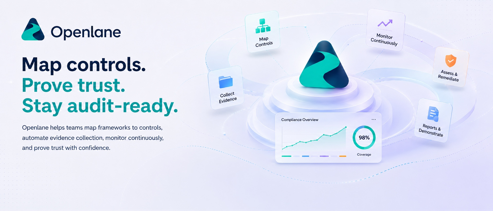

[Openlane](https://www.theopenlane.io) is the open-source compliance automation alternative to Vanta, Drata, and Secureframe. We believe the software companies use to demonstrate trust should itself be auditable. That's why the heart of our [cloud service](https://console.theopenlane.io/signup) is developed here in the open.

That principle shapes how we build: security features like SSO and 2FA enforcement ship with every module rather than sitting behind an enterprise tier. The stack runs on other open libraries and technologies such as [ent](https://entgo.io/docs/getting-started), PostgreSQL, Redis, and [OpenFGA](https://openfga.dev/) instead of requiring you to have a pile of SaaS dependencies but still claiming to be "open-source" like [CompAI](https://github.com/trycompai/comp#built-with).

See the difference yourself - [sign up](https://console.theopenlane.io/signup) for free for the first 30 days, no credit card required, no "request a demo" button, and transparent [pricing](https://www.theopenlane.io/pricing) so you only pay for what your team uses.

[Docs](https://docs.theopenlane.io) · [Discord](https://discord.gg/4fq2sxDk7D) · [LinkedIn](https://www.linkedin.com/company/theopenlane) · [Quickstart](https://docs.theopenlane.io/docs/platform/quickstartguide)

